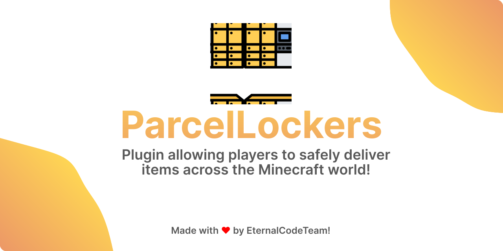

<div align="center">



[](https://papermc.io)
[](https://spigotmc.org)

[](https://ko-fi.com/eternalcodeteam)
[](https://eternalcode.pl/)
[](https://discord.com/invite/FQ7jmGBd6c)

[](https://gradle.org/)
[](https://www.java.com/)
[](https://github.com/Rollczi/LiteCommands)

</div>

# Welcome to ParcelLockers! 🚀

ParcelLockers is a minecraft plugin, dedicated for Spigot-based servers.. 💎 Crafted with care, ParcelLockers
is dedicated to incorporating highly practical server function of transfering items across the Minecraft world,
especially on long distances.

## ℹ️ Information

- ParcelLockers *currently* supports only latest Minecraft version.
- Requires **Java 21 or later** to work properly. For older versions of Java, this may affect the functionality of the
  plugin.
- If you have any questions, you can ask us about it on our [Discord server](https://discord.gg/FQ7jmGBd6c).

## ❗Warning

ParcelLockers is at an very early stage of development, and you use it at your own risk.

## 🏗️ Compiling JAR from Source

To build ParcelLockers, follow these steps (Make sure you have **JDK 21 or higher**):

```shell
./gradlew shadowJar
```

- The output JAR file will be located at `build/libs`.
- When you build the plugin for the first time, it might take a while to download all the dependencies.

## 🛠️ Development builds

🤫 Want to be a few steps ahead of others? You can gather our freshly squeezed builds from GitHub
Actions [here](https://github.com/EternalCodeTeam/ParcelLockers/actions).

## :octocat: Contributing

🧩 Are you a developer and want to add something?

Create a [public fork of the repository](https://github.com/EternalCodeTeam/ParcelLockers/fork), modify it with
appropriate
changes and then create a Pull Request.
See [CONTRIBUTING.md](https://github.com/EternalCodeTeam/ParcelLockers/blob/master/.github/CONTRIBUTING.md) to find out
more.

## 🐛 Issues

Found a bug? Report it [here](https://github.com/EternalCodeTeam/ParcelLockers/issues). If you are not sure if that's an
intended behavior or not, feel free to ask on our [Discord](https://discord.com/invite/FQ7jmGBd6c) 😅

Additionally, if you enable automatic Sentry bug
reporting in your config.yml file (we strongly advise to do so), errors will be automatically sent to us, which will
greatly accelerate the bug fixing process 🥳

## ❤️ Other dependencies usages

- [LiteCommands (by Rollczi ❤️)](https://github.com/Rollczi/LiteCommands)
- [Adventure API & MiniMessage](https://docs.adventure.kyori.net/)
- [CDN Configs](https://github.com/dzikoysk/cdn)
- [PaperLib](https://github.com/PaperMC/PaperLib)
- [Lombok](https://projectlombok.org)
- [Spigot API](https://www.spigotmc.org/wiki/spigot-maven/#build-gradle)
- [expressible](https://github.com/dzikoysk/expressible)
- [panda-utilities](https://github.com/panda-lang/panda)
- [TriumphGUI](https://github.com/TriumphTeam/triumph-gui)
- [bStats](https://bstats.org/)
- [jackson-bukkit](https://github.com/eldoriarpg/jackson-bukkit)
- [SignGUI](https://github.com/Rapha149/SignGUI)

## :heart: Special Thanks

[](https://www.jetbrains.com)
[](https://www.sentry.io)

We express our gratitude to JetBrains for providing [Open Source Licenses](https://www.jetbrains.com/opensource/) for
their outstanding tools. We recommend using [IntelliJ IDEA](https://www.jetbrains.com/idea/) to work with our projects
and boost your productivity!

We also thank [Sentry](https://sentry.io) for providing us with
a [Open-Source Sponsorship plan](https://sentry.io/for/open-source/) for error tracking. We recommend using
[Sentry](https://sentry.io) to track errors in your projects and improve the quality of your software.


